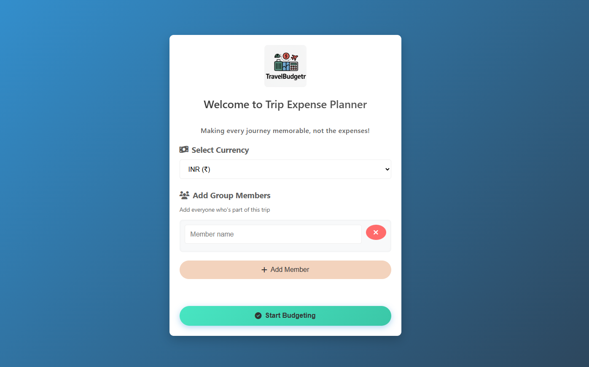
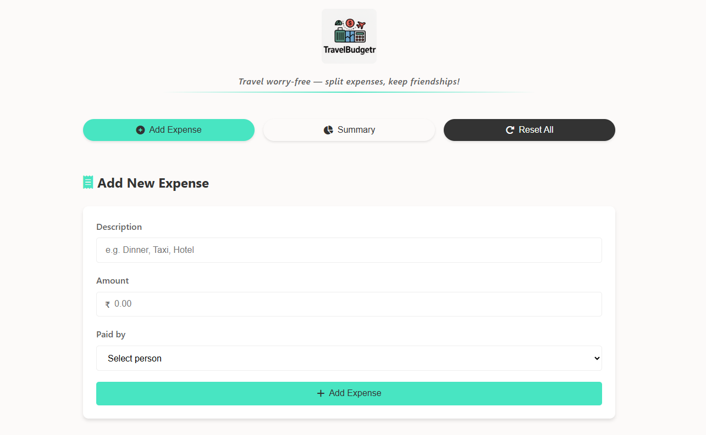
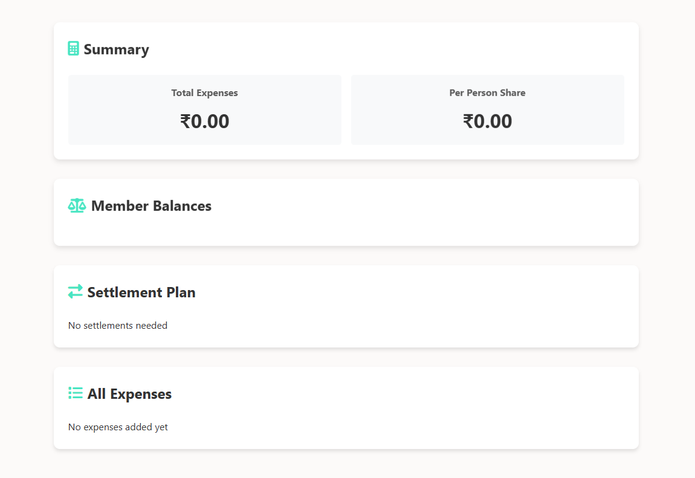

# TravelBudgetr


A simple, intuitive web app for tracking and splitting travel expenses among group members.

## 🌟 Features

- **Group Setup**: Add multiple group members and set your preferred currency
- **Expense Tracking**: Easily add expenses with descriptions, amounts, and payers
- **Smart Expense Summary**: View total expenses and per-person breakdown
- **Automatic Balance Calculation**: See who owes money and who should receive money
- **Settlement Plan**: Get a clear plan showing exactly who should pay whom
- **Data Persistence**: Your expense data is saved in your browser's local storage
- **Responsive Design**: Works seamlessly on desktop, tablet, and mobile devices

## 📱 Screenshots





## 🛠️ Technologies Used

- **HTML5** - For structure
- **CSS3** - For styling and responsive design
- **JavaScript** - For application logic
- **Local Storage API** - For data persistence between sessions
- **Font Awesome** - For icons

## 🚀 Getting Started

### Option 1: Run Locally

1. Clone this repository:
   ```
   git clone https://github.com/sohamindia123/TravelBudgetr.git
   ```

2. Navigate to the project directory:
   ```
   cd TravelBudgetr
   ```

3. Open `index.html` in your web browser.

### Option 2: Use the Live Demo

Visit [TravelBudgetr Live Demo](https://sohamindia123.github.io/Travel-Budgetr/) to use the application without installation.

## 💻 How to Use

1. **Initial Setup**:
   - Select your preferred currency
   - Add all group members who will share expenses
   - Click "Start Budgeting"

2. **Adding Expenses**:
   - Enter a description of the expense
   - Enter the amount spent
   - Select who paid for the expense
   - Click "Add Expense"

3. **Viewing Summary**:
   - See total expenses and per-person share
   - View individual balances (who owes, who should receive)
   - Check the settlement plan for the most efficient way to settle debts
   - Review all recorded expenses

4. **Resetting Data**:
   - Click "Reset All" to clear all data and start a new trip

## 🔒 Privacy

All data is stored locally on your device. TravelBudgetr doesn't collect or transmit any of your financial information.

## 🤝 Contributing

Contributions are welcome! If you'd like to contribute:

1. Fork the repository
2. Create a new branch (`git checkout -b feature/amazing-feature`)
3. Make your changes
4. Commit your changes (`git commit -m 'Add some amazing feature'`)
5. Push to the branch (`git push origin feature/amazing-feature`)
6. Open a Pull Request

## 📃 License

This project is licensed under the MIT License - see the [LICENSE](LICENSE) file for details.


## Made with ❤️ for travelers who want to focus on experiences, not expenses. 
